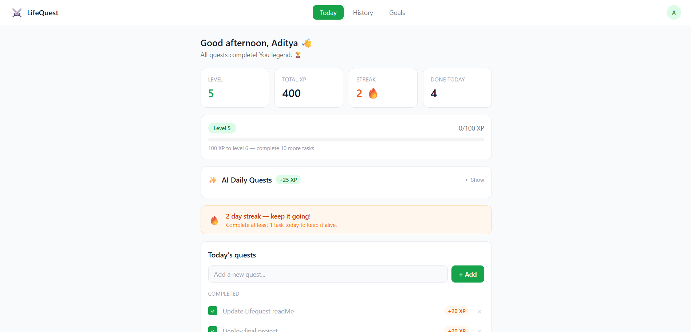
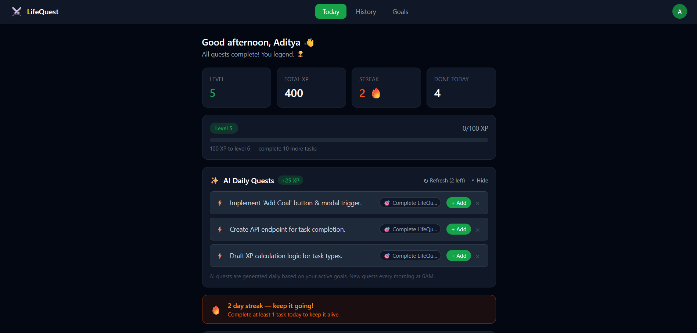
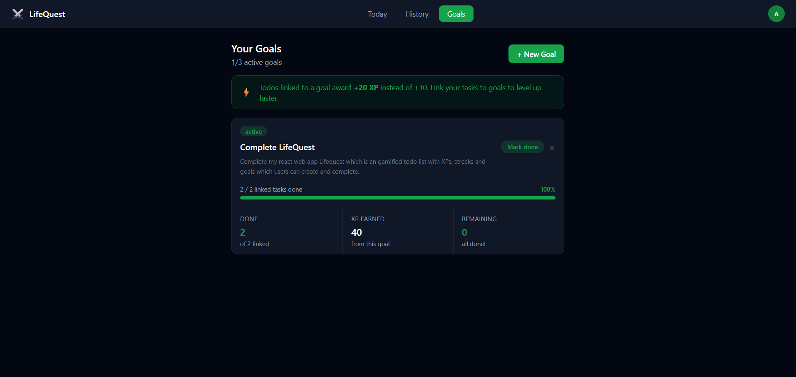
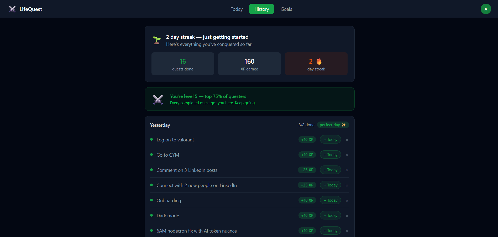
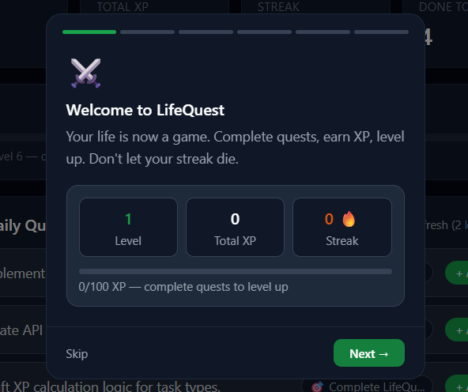
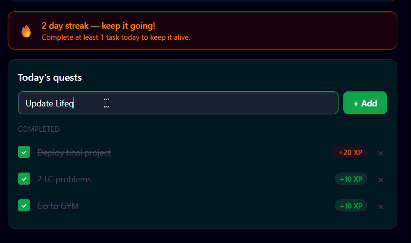

# LifeQuest ⚔️

> A gamified productivity app where your goals become quests, your tasks earn XP, and your streak keeps you accountable.

**[Live Demo](https://life-quest-chi.vercel.app/)** · Built with React, Node.js, PostgreSQL & Gemini AI



---

## What is LifeQuest?

Most productivity apps are just glorified checklists. LifeQuest turns your daily grind into a game — set real goals, complete daily quests, earn XP, level up, and watch your streak grow. Every task you log becomes part of your history, giving you a record of everything you've accomplished over time.

---

## Features

### 🎮 Gamification

- XP system — earn +10 XP per quest, +20 XP when linked to a goal
- Level up every 100 XP with a visual progress bar
- Daily streak tracking — complete at least 1 quest per day to keep it alive
- Quest completion sound and confetti effects

### 🎯 Goals & AI Quests

- Create up to 3 active goals with title, description, and deadline
- Google Gemini AI generates 3 personalized daily quests based on your active goals
- Rate-limited to 2 manual generations per day to prevent abuse
- AI quests earn +25 XP when added and completed

### 📖 History

- Every completed quest is logged by date
- "Perfect day" badge when all quests for a day are completed
- Resurrect past tasks back to today's queue
- Cumulative XP and quest count stats

### 🔐 Auth

- JWT-based authentication with 7-day token expiry
- Forgot password flow with email reset via Resend + custom domain
- Secure bcrypt password hashing

### 🌙 Dark Mode

- Full dark mode with CSS-based theming
- Persistent toggle via localStorage — respects OS preference by default
- Avatar dropdown in navbar for quick access

### 🧭 Onboarding

- 6-step gamified onboarding modal for new users
- Shows actual UI previews of each feature
- Victory sound on completion
- Never shown again after completion (stored in DB)

---

## Screenshots

| Dashboard (Light)                                     | Dashboard (Dark)                                    |
| ----------------------------------------------------- | --------------------------------------------------- |
|  |  |

| Goals                             | History                               |
| --------------------------------- | ------------------------------------- |
|  |  |

**Onboarding**


**Adding a quest, linking to a goal, and completing it**


---

## Tech Stack

| Layer      | Tech                                   |
| ---------- | -------------------------------------- |
| Frontend   | React 18, Vite, Tailwind CSS v4        |
| Backend    | Node.js, Express.js                    |
| Database   | PostgreSQL via Supabase                |
| AI         | Google Gemini API (`gemini-2.5-flash`) |
| Email      | Resend + custom domain                 |
| Auth       | JWT, bcryptjs                          |
| Deployment | Vercel (frontend), Render (backend)    |

---

## Running Locally

### Prerequisites

- Node.js 18+
- A Supabase project (PostgreSQL)
- Gemini API key
- Resend API key

### Backend

```bash
cd server
npm install
```

Create a `.env` file in `/server`:

```env
DATABASE_URL=your_supabase_connection_string
JWT_SECRET=your_jwt_secret
GEMINI_API_KEY=your_gemini_key
RESEND_API_KEY=your_resend_key
CLIENT_URL=http://localhost:5173
```

```bash
node index.js
```

### Frontend

```bash
cd client
npm install
```

Create a `.env` file in `/client`:

```env
VITE_API_URL=http://localhost:5000/api
```

```bash
npm run dev
```

### Database

Run the following in your Supabase SQL editor to set up the schema:

```sql
CREATE TABLE users (
  id SERIAL PRIMARY KEY,
  name TEXT NOT NULL,
  email TEXT UNIQUE NOT NULL,
  password TEXT NOT NULL,
  xp INT DEFAULT 0,
  level INT DEFAULT 1,
  streak INT DEFAULT 0,
  last_active DATE,
  reset_token TEXT,
  reset_token_expires BIGINT,
  onboarding_complete BOOLEAN DEFAULT FALSE,
  daily_suggestion_count INT DEFAULT 0,
  suggestion_reset_date DATE DEFAULT CURRENT_DATE
);

CREATE TABLE todos (
  id SERIAL PRIMARY KEY,
  user_id INT REFERENCES users(id) ON DELETE CASCADE,
  title TEXT NOT NULL,
  is_completed BOOLEAN DEFAULT FALSE,
  is_ai_suggested BOOLEAN DEFAULT FALSE,
  xp_reward INT DEFAULT 10,
  goal_id INT REFERENCES goals(id) ON DELETE SET NULL,
  created_at TIMESTAMPTZ DEFAULT NOW(),
  completed_at TIMESTAMPTZ
);

CREATE TABLE goals (
  id SERIAL PRIMARY KEY,
  user_id INT REFERENCES users(id) ON DELETE CASCADE,
  title TEXT NOT NULL,
  description TEXT,
  deadline DATE,
  is_completed BOOLEAN DEFAULT FALSE,
  created_at TIMESTAMPTZ DEFAULT NOW()
);

CREATE TABLE ai_suggestions (
  id SERIAL PRIMARY KEY,
  user_id INT REFERENCES users(id) ON DELETE CASCADE,
  goal_id INT REFERENCES goals(id) ON DELETE SET NULL,
  title TEXT NOT NULL,
  xp_reward INT DEFAULT 25,
  is_added BOOLEAN DEFAULT FALSE,
  suggested_date DATE DEFAULT CURRENT_DATE,
  created_at TIMESTAMPTZ DEFAULT NOW()
);
```

---

## Project Structure

```
lifequest/
├── client/                 # React frontend
│   └── src/
│       ├── components/     # Navbar, StatCard, TodoItem, XPBar, AISuggestions, Onboarding...
│       ├── context/        # AuthContext, ThemeContext
│       ├── pages/          # Dashboard, Goals, History, Login, Register...
│       └── api/            # Axios instance
└── server/                 # Node.js backend
    ├── controllers/        # Auth, todos, goals, suggestions
    ├── middleware/         # JWT auth middleware
    ├── routes/             # Express routes
    ├── services/           # Gemini AI suggestion service
    └── db.js               # PostgreSQL pool
```

---

## What I Learned

- Designing a full gamification system from scratch (XP, levels, streaks)
- Integrating Google Gemini API with prompt engineering for actionable task generation
- Building a complete auth flow including forgot password with transactional email
- Tailwind v4 dark mode using CSS custom variants
- Rate limiting AI API calls on both frontend and backend
- Deploying a decoupled React + Node.js app across Vercel and Render

---

## Author

**Aditya Panicker** · [adityapanicker.com](https://adityapanicker.com) · [LinkedIn](https://linkedin.com/in/aditya-panicker) · [GitHub](https://github.com/adipanicker)
